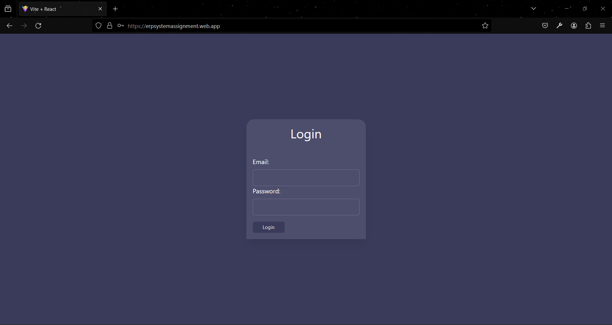
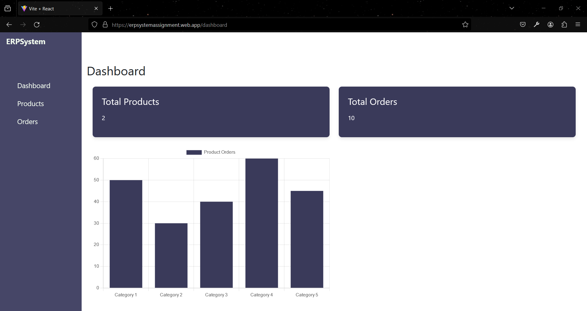
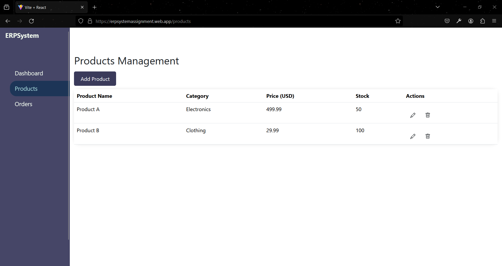
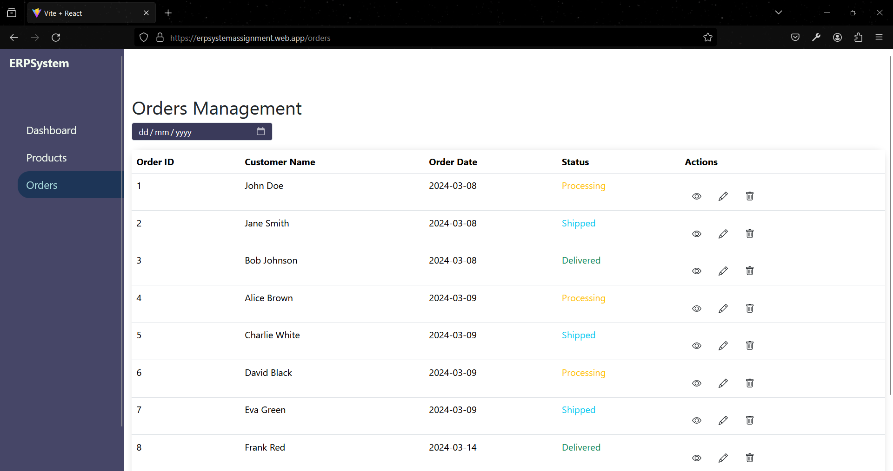
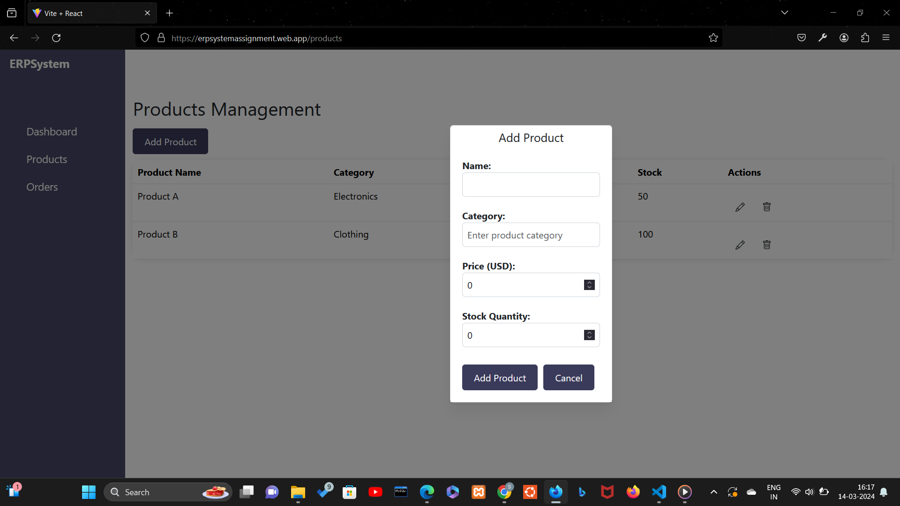
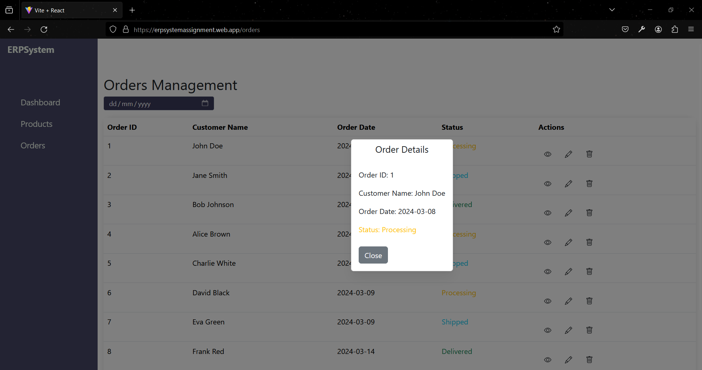

# ERP System

## Overview

ERP Management System is a web-based application designed to manage various aspects of an enterprise resource planning system, including products, orders, and dashboard analytics. The system utilizes local storage to store product and order data, ensuring seamless user experience without the need for a backend database.

## Features

- **User Authentication**: Secure user authentication using Firebase authentication.
- **Dashboard**: Provides an overview of total products, orders, and analytics.
- **Product Management**: Allows admin to add, edit, and delete products.
- **Order Management**: Enables admin to view, edit, and delete orders, and view orders with a filter calendar.
- **Responsive Design**: Responsive layout ensures an optimal viewing experience across different devices.

## Technologies Used

- React.js
- Firebase
- Chart.js
- Bootstrap

## Getting Started

### Installation

**1. Download or Clone the Repository:**
   - Download the repository manually or use the following command:
     ```bash
     git clone https://github.com/nsonika/ERPSystem
     ```

**2. Open in Code Editor:**
   - Open the downloaded/cloned folder in your preferred code editor.

**3. Run Terminal:**
   - Open a terminal within the code editor or use your system's terminal.

**4. Install Dependencies:**
   - Type the following command to download the project dependencies:
     ```bash
     npm install
     ```

**5. Start:**
   - Type the following command to start the development server:
     ```bash
     npm run dev
     ```

## Access

- **Admin Credentials:**
  - **Email:** admin@gmail.com
  - **Password:** password

- [Hosted link to the ERP System](https://erpsystemassignment.web.app/)


## Screenshots

### Login Page


### Dashboard


### Products Page


### Orders Page


### Add/Edit Product Page


### View Order Page

